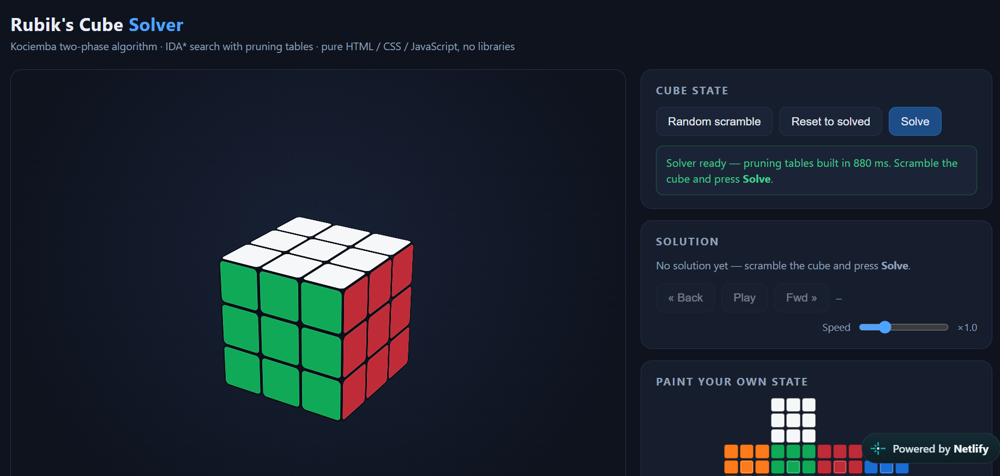

# Rubik's Cube Solver — Kociemba Two-Phase Algorithm

A fully client-side Rubik's Cube solver that implements the **Kociemba two-phase algorithm** using IDA search with precomputed pruning tables.  
All computations happen locally in your browser — no network requests, no dependencies, and no server-side processing.

 

## ✨ Features

- **Interactive 3D Cube** – Drag to rotate the view, click face buttons to turn layers manually.
- **Kociemba Two‑Phase Solver** – Finds near‑optimal solutions (average ~22 moves) in real time.
- **Web Worker Support** – Pruning tables are generated in a background thread, keeping the UI responsive.
- **Step‑by‑Step Playback** – Watch the solution unfold move by move, pause, step forward/backward, and control playback speed.
- **Scramble & Reset** – Generate a random 25‑move scramble or reset to the solved state.
- **Paint‑Your‑Own State** – Edit the facelet colors directly on a 2D net, then apply your custom configuration (validated for legal cube states).
- **No Installation** – Single HTML file, open in any modern browser.

## 🧠 How It Works

The solver follows the classical **Kociemba two‑phase algorithm**:

1. **Phase 1** – Reduce the cube to the subgroup  
   `G₁ = ⟨U, D, R², L², F², B²⟩`  
   by solving corner orientations, edge orientations, and placing the middle‑layer (slice) edges into their correct positions.
2. **Phase 2** – Solve the remaining cube using only half turns and U/D quarter turns, with an optimal IDA* search.

Both phases are accelerated by **pruning tables** generated via BFS over the coordinate spaces:
- (twist, slice combination)
- (flip, slice combination)
- (slice permutation, corner permutation)
- (slice permutation, edge permutation)

The search is performed inside a **Web Worker** to avoid blocking the main thread, and the tables are built once at startup (takes ~1‑3 seconds depending on your device).

## 🚀 Getting Started

### Online Demo

[**Launch the Solver**](https://your-demo-link.com) *(if hosted)*

### Local Usage

1. Clone or download the repository.
2. Open `index.html` in any modern web browser (Chrome, Firefox, Edge, Safari).
3. Wait a few seconds for the pruning tables to build (you'll see progress updates).
4. Scramble the cube, paint a custom state, or simply click **Solve**!

No build tools, no npm, no installation – just pure HTML / CSS / JavaScript.

## 🎮 User Interface

| Control | Description |
|---------|-------------|
| **3D Viewport** | Drag to orbit the camera. |
| **Move Pad** | Press buttons like `U`, `R'`, `F`, etc. to apply manual turns. |
| **Random Scramble** | Generates a legal 25‑move scramble. |
| **Reset** | Restores the solved cube. |
| **Solve** | Starts the IDA* search; displays the solution in two phases. |
| **Playback Controls** | Play, pause, step forward/backward, and adjust speed. |
| **Paint Net** | Click stickers to recolor the cube; **Apply** validates and loads the new state. |

## 🛠️ Technical Details

- **Core Engine** – Custom JavaScript implementation of the Kociemba algorithm, including:
  - Cubie‑level representation (corner permutation/orientation, edge permutation/orientation).
  - Facelet ↔ cubie conversion (Kociemba layout).
  - Move tables and pruning table generation (BFS).
  - IDA* search with move ordering and pruning heuristics.
- **3D Rendering** – CSS 3D transforms with a perspective scene; all 26 cubies are positioned dynamically.
- **Concurrency** – Web Worker for heavy computations; fallback to main thread if workers are unavailable.
- **Performance** – Tables are stored as `Uint8Array` / `Uint16Array` for memory efficiency; search typically completes within a few seconds.

## 🤝 Contributing

Contributions are welcome! If you find a bug, have a feature request, or want to improve the algorithm, please open an issue or submit a pull request.

- For major changes, please discuss the idea first.
- Keep the code self‑contained (no external libraries).
- Ensure all tests (manual) pass.

## 🙏 Acknowledgements

- Herbert Kociemba – for the original two‑phase algorithm and insights.
- The cubing community – for open discussions and resources.

---

**Happy cubing!** 🧩
